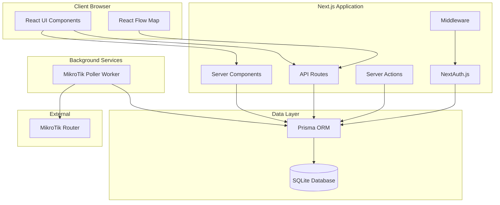

# Design Document: MikroTik Netwatch Visual Dashboard

## Overview

The MikroTik Netwatch Visual Dashboard is a full-stack web application built with Next.js 14+ that provides real-time visual monitoring of network devices. The system integrates with MikroTik RouterOS Netwatch to poll device status and displays an interactive map where devices are represented as draggable nodes with visual status indicators.

The architecture follows a clear separation of concerns:
- **Frontend**: Next.js App Router with React Server Components and Client Components
- **Backend**: Next.js API Routes and Server Actions for data mutations
- **Database**: SQLite with Prisma ORM for data persistence
- **Background Worker**: Standalone Node.js process for MikroTik polling
- **Authentication**: NextAuth.js v5 with role-based access control

## Architecture

### System Components



### Data Flow

1. **Authentication Flow**:
   - User submits credentials → NextAuth validates against database → Session created with role
   - Middleware checks session and role for protected routes

2. **Device Status Polling Flow**:
   - Background worker connects to MikroTik → Queries Netwatch → Compares with DB → Updates device status
   - Client polls API every 5 seconds → Receives updated status → Updates UI

3. **Device Management Flow**:
   - Admin/Operator submits device form → Server Action validates → Prisma creates/updates record → UI refreshes

4. **Map Interaction Flow**:
   - User drags node → onNodeDragStop event → API call with new coordinates → Database updated → Position persisted

## Components and Interfaces

### Frontend Components

#### 1. Authentication Components

**LoginForm** (`app/login/page.tsx`)
- Client Component with form state management
- Calls NextAuth signIn with credentials provider
- Redirects to dashboard on success

**SessionProvider** (`app/providers.tsx`)
- Wraps application to provide session context
- Enables useSession hook throughout app

#### 2. Layout Components

**DashboardLayout** (`app/dashboard/layout.tsx`)
- Server Component that checks authentication
- Renders navigation sidebar with role-based menu items
- Shows user info and logout button

**Sidebar** (`components/Sidebar.tsx`)
- Displays navigation links based on user role
- ADMIN: All links (Map, Devices, Config, Profile)
- OPERATOR: Map, Devices, Profile
- VIEWER: Map, Profile

#### 3. Device Management Components

**DeviceList** (`app/dashboard/manage/devices/page.tsx`)
- Server Component that fetches devices via Prisma
- Renders table with device information
- Includes Add/Edit/Delete action buttons (role-gated)

**DeviceForm** (`components/DeviceForm.tsx`)
- Client Component with form validation
- Fields: name, IP, type (select), laneName
- Calls Server Action for create/update operations
- IP uniqueness validation

**DeviceTable** (`components/DeviceTable.tsx`)
- Displays devices in responsive table
- Shows icon based on device type using Lucide React
- Status indicator (colored badge)
- Action buttons for edit/delete

#### 4. Interactive Map Components

**DeviceMap** (`app/dashboard/map/page.tsx`)
- Client Component using React Flow
- Fetches device data via SWR with 5-second revalidation
- Renders custom device nodes
- Handles drag events for Admin/Operator roles

**DeviceNode** (`components/DeviceNode.tsx`)
- Custom React Flow node component
- Renders device icon based on type:
  - ROUTER → `<Router />` icon
  - TABLET → `<Tablet />` icon
  - SCANNER_GTEX → `<ScanBarcode />` icon
  - SMART_TV → `<Tv />` icon
- Applies status styling:
  - UP: green border, normal state
  - DOWN: red border + `animate-pulse` class
- Displays device name and lane name

#### 5. Configuration Components

**SystemConfigForm** (`app/dashboard/admin/config/page.tsx`)
- Admin-only Server Component
- Form for MikroTik connection settings
- Fields: IP, username, password, port, polling interval
- Server Action for updates

#### 6. Profile Components

**ProfileForm** (`app/dashboard/profile/page.tsx`)
- Client Component for password change
- Fields: current password, new password, confirm password
- Validates current password before update
- Calls API route for password change

### Backend Components

#### 1. Database Schema (Prisma)

```prisma
// prisma/schema.prisma

datasource db {
  provider = "sqlite"
  url      = "file:./devicemap.db"
}

generator client {
  provider = "prisma-client-js"
}

enum Role {
  ADMIN
  OPERATOR
  VIEWER
}

enum DeviceType {
  ROUTER
  TABLET
  SCANNER_GTEX
  SMART_TV
}

model User {
  id        String   @id @default(cuid())
  username  String   @unique
  password  String   // bcrypt hashed
  name      String
  role      Role     @default(VIEWER)
  createdAt DateTime @default(now())
  updatedAt DateTime @updatedAt
}

model SystemConfig {
  id              Int    @id @default(1)
  pollingInterval Int    @default(30) // seconds
  mikrotikIp      String @default("")
  mikrotikUser    String @default("")
  mikrotikPass    String @default("") // encrypted
  mikrotikPort    Int    @default(8728)
  updatedAt       DateTime @updatedAt
}

model Device {
  id        String     @id @default(cuid())
  ip        String     @unique
  name      String
  type      DeviceType
  laneName  String
  status    String     @default("unknown") // "up", "down", "unknown"
  positionX Float      @default(0)
  positionY Float      @default(0)
  lastSeen  DateTime?
  createdAt DateTime   @default(now())
  updatedAt DateTime   @updatedAt
}
```

#### 2. API Routes

**GET /api/devices**
- Returns all devices with current status
- Accessible to all authenticated users
- Response: `{ devices: Device[] }`

**POST /api/devices**
- Creates new device
- Requires ADMIN or OPERATOR role
- Validates IP uniqueness
- Request body: `{ name, ip, type, laneName }`
- Response: `{ device: Device }`

**PUT /api/devices/[id]**
- Updates existing device
- Requires ADMIN or OPERATOR role
- Request body: `{ name?, ip?, type?, laneName? }`
- Response: `{ device: Device }`

**DELETE /api/devices/[id]**
- Deletes device
- Requires ADMIN or OPERATOR role
- Response: `{ success: boolean }`

**POST /api/device/move**
- Updates device position coordinates
- Requires ADMIN or OPERATOR role
- Request body: `{ deviceId, positionX, positionY }`
- Response: `{ success: boolean }`

**GET /api/config**
- Returns system configuration
- Requires ADMIN role
- Response: `{ config: SystemConfig }`

**PUT /api/config**
- Updates system configuration
- Requires ADMIN role
- Request body: `{ pollingInterval?, mikrotikIp?, mikrotikUser?, mikrotikPass?, mikrotikPort? }`
- Response: `{ config: SystemConfig }`

**POST /api/profile/password**
- Changes user password
- Requires authentication (any role)
- Request body: `{ currentPassword, newPassword }`
- Response: `{ success: boolean }`

#### 3. Server Actions

**createDevice** (`app/actions/devices.ts`)
```typescript
'use server'
async function createDevice(data: {
  name: string
  ip: string
  type: DeviceType
  laneName: string
}) {
  // Validate session and role
  // Check IP uniqueness
  // Create device via Prisma
  // Revalidate path
}
```

**updateDevice** (`app/actions/devices.ts`)
```typescript
'use server'
async function updateDevice(id: string, data: Partial<Device>) {
  // Validate session and role
  // Update device via Prisma
  // Revalidate path
}
```

**deleteDevice** (`app/actions/devices.ts`)
```typescript
'use server'
async function deleteDevice(id: string) {
  // Validate session and role
  // Delete device via Prisma
  // Revalidate path
}
```

**updateSystemConfig** (`app/actions/config.ts`)
```typescript
'use server'
async function updateSystemConfig(data: Partial<SystemConfig>) {
  // Validate session (ADMIN only)
  // Encrypt password if provided
  // Update config via Prisma
  // Revalidate path
}
```

#### 4. Authentication Configuration

**NextAuth Config** (`auth.ts`)
```typescript
import NextAuth from "next-auth"
import Credentials from "next-auth/providers/credentials"
import { PrismaAdapter } from "@auth/prisma-adapter"
import bcrypt from "bcryptjs"

export const { handlers, auth, signIn, signOut } = NextAuth({
  adapter: PrismaAdapter(prisma),
  providers: [
    Credentials({
      credentials: {
        username: { label: "Username", type: "text" },
        password: { label: "Password", type: "password" }
      },
      async authorize(credentials) {
        const user = await prisma.user.findUnique({
          where: { username: credentials.username }
        })
        
        if (!user) return null
        
        const isValid = await bcrypt.compare(
          credentials.password,
          user.password
        )
        
        if (!isValid) return null
        
        return {
          id: user.id,
          name: user.name,
          username: user.username,
          role: user.role
        }
      }
    })
  ],
  callbacks: {
    async jwt({ token, user }) {
      if (user) {
        token.role = user.role
        token.id = user.id
      }
      return token
    },
    async session({ session, token }) {
      if (session.user) {
        session.user.role = token.role
        session.user.id = token.id
      }
      return session
    }
  },
  pages: {
    signIn: '/login'
  }
})
```

**Middleware** (`middleware.ts`)
```typescript
import { auth } from "./auth"
import { NextResponse } from "next/server"

export default auth((req) => {
  const { pathname } = req.nextUrl
  const session = req.auth
  
  if (!session && pathname.startsWith('/dashboard')) {
    return NextResponse.redirect(new URL('/login', req.url))
  }
  
  if (session) {
    const role = session.user.role
    
    // Admin routes
    if (pathname.startsWith('/dashboard/admin') && role !== 'ADMIN') {
      return NextResponse.redirect(new URL('/dashboard/map', req.url))
    }
    
    // Management routes
    if (pathname.startsWith('/dashboard/manage') && 
        role !== 'ADMIN' && role !== 'OPERATOR') {
      return NextResponse.redirect(new URL('/dashboard/map', req.url))
    }
  }
  
  return NextResponse.next()
})

export const config = {
  matcher: ['/dashboard/:path*']
}
```

#### 5. Background Worker

**MikroTik Poller** (`worker.ts`)
```typescript
import { PrismaClient } from '@prisma/client'
import { RouterOSAPI } from 'node-routeros'

const prisma = new PrismaClient()

async function pollMikroTik() {
  try {
    // Load config
    const config = await prisma.systemConfig.findUnique({
      where: { id: 1 }
    })
    
    if (!config || !config.mikrotikIp) {
      console.log('MikroTik not configured')
      return
    }
    
    // Connect to MikroTik
    const api = new RouterOSAPI({
      host: config.mikrotikIp,
      user: config.mikrotikUser,
      password: config.mikrotikPass,
      port: config.mikrotikPort
    })
    
    await api.connect()
    
    // Get netwatch data
    const netwatch = await api.write('/tool/netwatch/print')
    
    // Get all devices from DB
    const devices = await prisma.device.findMany()
    
    // Update device status
    for (const device of devices) {
      const netwatchEntry = netwatch.find(
        (entry: any) => entry.host === device.ip
      )
      
      if (netwatchEntry) {
        const newStatus = netwatchEntry.status === 'up' ? 'up' : 'down'
        
        if (device.status !== newStatus) {
          await prisma.device.update({
            where: { id: device.id },
            data: {
              status: newStatus,
              lastSeen: new Date()
            }
          })
          console.log(`Device ${device.name} status changed to ${newStatus}`)
        }
      }
    }
    
    await api.close()
    
  } catch (error) {
    console.error('Polling error:', error)
    // Don't crash - continue polling
  }
}

async function startPoller() {
  console.log('Starting MikroTik poller...')
  
  // Initial poll
  await pollMikroTik()
  
  // Get polling interval
  const config = await prisma.systemConfig.findUnique({
    where: { id: 1 }
  })
  
  const interval = (config?.pollingInterval || 30) * 1000
  
  // Set up interval
  setInterval(pollMikroTik, interval)
}

startPoller()
```

## Data Models

### User Model
- **id**: Unique identifier (CUID)
- **username**: Unique login name
- **password**: Bcrypt hashed password
- **name**: Display name
- **role**: ADMIN | OPERATOR | VIEWER
- **createdAt**: Account creation timestamp
- **updatedAt**: Last modification timestamp

### SystemConfig Model
- **id**: Always 1 (singleton)
- **pollingInterval**: Seconds between polls (default: 30)
- **mikrotikIp**: MikroTik router IP address
- **mikrotikUser**: MikroTik API username
- **mikrotikPass**: Encrypted MikroTik password
- **mikrotikPort**: MikroTik API port (default: 8728)
- **updatedAt**: Last configuration change

### Device Model
- **id**: Unique identifier (CUID)
- **ip**: Unique IP address
- **name**: Device display name
- **type**: ROUTER | TABLET | SCANNER_GTEX | SMART_TV
- **laneName**: Logical grouping (e.g., "Lane A")
- **status**: "up" | "down" | "unknown"
- **positionX**: X coordinate on map (Float)
- **positionY**: Y coordinate on map (Float)
- **lastSeen**: Last successful ping timestamp
- **createdAt**: Device creation timestamp
- **updatedAt**: Last modification timestamp

## Correctness Properties

*A property is a characteristic or behavior that should hold true across all valid executions of a system—essentially, a formal statement about what the system should do. Properties serve as the bridge between human-readable specifications and machine-verifiable correctness guarantees.*

### Property 1: Role-based route access enforcement

*For any* authenticated user with role VIEWER, attempting to access management or admin routes should result in redirection to the map view.

**Validates: Requirements 1.5, 1.6**

### Property 2: IP address uniqueness

*For any* two devices in the system, their IP addresses must be distinct.

**Validates: Requirements 2.1**

### Property 3: Device type icon mapping consistency

*For any* device displayed on the map, the rendered icon must correspond to its device type according to the mapping: ROUTER → Router icon, TABLET → Tablet icon, SCANNER_GTEX → ScanBarcode icon, SMART_TV → Tv icon.

**Validates: Requirements 5.2**

### Property 4: Status visual indication

*For any* device with status "down", the node must be rendered with red color and pulsing animation; for status "up", the node must be rendered with green color.

**Validates: Requirements 5.3, 5.4**

### Property 5: Position persistence

*For any* device, after updating its position coordinates (positionX, positionY) in the database, retrieving the device should return the same coordinates.

**Validates: Requirements 5.5, 5.6**

### Property 6: Drag permission enforcement

*For any* user with role VIEWER viewing the map, node dragging must be disabled; for users with role ADMIN or OPERATOR, node dragging must be enabled.

**Validates: Requirements 5.7**

### Property 7: Password hashing

*For any* user password stored in the database, it must be a bcrypt hash, not plaintext.

**Validates: Requirements 1.2, 7.3**

### Property 8: Session role inclusion

*For any* authenticated session, the session object must contain the user's role.

**Validates: Requirements 1.3**

### Property 9: Device status update on change

*For any* device, when the MikroTik Netwatch status changes from "up" to "down" or vice versa, the database status field must be updated to reflect the new status.

**Validates: Requirements 3.6**

### Property 10: Poller resilience

*For any* MikroTik connection failure, the poller process must continue running and attempt reconnection on the next polling cycle without crashing.

**Validates: Requirements 3.7**

### Property 11: API authorization

*For any* API endpoint requiring ADMIN or OPERATOR role, requests from users with VIEWER role must return a 403 Forbidden response.

**Validates: Requirements 2.7, 10.8**

### Property 12: Configuration singleton

*For any* query to the SystemConfig table, at most one record should exist with id = 1.

**Validates: Requirements 4.1**

### Property 13: Client-side status refresh

*For any* map view, device status must be refreshed from the server at intervals not exceeding 5 seconds.

**Validates: Requirements 6.1, 5.8**

### Property 14: Device creation with defaults

*For any* newly created device, if position coordinates are not specified, they must default to (0, 0) and status must default to "unknown".

**Validates: Requirements 2.4**

### Property 15: Polling interval configuration

*For any* valid polling interval value (positive integer), updating the SystemConfig should persist the new value and the poller should use it on the next cycle.

**Validates: Requirements 4.2, 4.5**

## Error Handling

### Authentication Errors
- **Invalid credentials**: Display "Invalid username or password" message
- **Session expiration**: Redirect to login page with message
- **Unauthorized access**: Redirect to appropriate page based on role

### Database Errors
- **Unique constraint violation**: Display "IP address already exists" for devices
- **Connection errors**: Log error and retry operation
- **Transaction failures**: Rollback and display generic error message

### MikroTik Connection Errors
- **Connection timeout**: Log error, continue polling on next cycle
- **Authentication failure**: Log error with details for admin review
- **API command errors**: Log error, skip current poll cycle

### Validation Errors
- **Invalid IP format**: Display "Please enter a valid IP address"
- **Empty required fields**: Display "This field is required"
- **Invalid polling interval**: Display "Polling interval must be a positive number"

### API Errors
- **400 Bad Request**: Return validation error details
- **401 Unauthorized**: Return "Authentication required"
- **403 Forbidden**: Return "Insufficient permissions"
- **404 Not Found**: Return "Resource not found"
- **500 Internal Server Error**: Log error, return generic message

## Testing Strategy

### Unit Testing

Unit tests will verify specific examples, edge cases, and error conditions using Jest and React Testing Library.

**Authentication Tests**:
- Test successful login with valid credentials
- Test login failure with invalid credentials
- Test session creation with correct role
- Test password hashing on user creation

**Device Management Tests**:
- Test device creation with valid data
- Test IP uniqueness validation
- Test device update operations
- Test device deletion

**API Route Tests**:
- Test each endpoint with valid requests
- Test authorization checks for each role
- Test error responses for invalid data
- Test 404 responses for non-existent resources

**Component Tests**:
- Test DeviceNode renders correct icon for each type
- Test DeviceNode applies correct styling for each status
- Test DeviceForm validation
- Test role-based UI element visibility

### Property-Based Testing

Property tests will verify universal properties across all inputs using fast-check (JavaScript property-based testing library). Each test will run a minimum of 100 iterations.

**Property Test 1: Role-based route access**
```typescript
// Feature: mikrotik-netwatch-dashboard, Property 1: Role-based route access enforcement
fc.assert(
  fc.property(
    fc.constantFrom('ADMIN', 'OPERATOR', 'VIEWER'),
    fc.constantFrom('/dashboard/admin/config', '/dashboard/manage/devices'),
    (role, route) => {
      const canAccess = checkRouteAccess(role, route)
      if (role === 'VIEWER') {
        return !canAccess
      }
      if (role === 'OPERATOR' && route.startsWith('/dashboard/admin')) {
        return !canAccess
      }
      return true
    }
  ),
  { numRuns: 100 }
)
```

**Property Test 2: IP uniqueness**
```typescript
// Feature: mikrotik-netwatch-dashboard, Property 2: IP address uniqueness
fc.assert(
  fc.property(
    fc.array(fc.ipV4(), { minLength: 2, maxLength: 10 }),
    async (ips) => {
      // Attempt to create devices with duplicate IPs
      const uniqueIps = new Set(ips)
      // Should only be able to create devices equal to unique IP count
      return true // Test implementation
    }
  ),
  { numRuns: 100 }
)
```

**Property Test 3: Icon mapping consistency**
```typescript
// Feature: mikrotik-netwatch-dashboard, Property 3: Device type icon mapping consistency
fc.assert(
  fc.property(
    fc.constantFrom('ROUTER', 'TABLET', 'SCANNER_GTEX', 'SMART_TV'),
    (deviceType) => {
      const icon = getIconForDeviceType(deviceType)
      const expectedIcons = {
        'ROUTER': 'Router',
        'TABLET': 'Tablet',
        'SCANNER_GTEX': 'ScanBarcode',
        'SMART_TV': 'Tv'
      }
      return icon === expectedIcons[deviceType]
    }
  ),
  { numRuns: 100 }
)
```

**Property Test 4: Status visual indication**
```typescript
// Feature: mikrotik-netwatch-dashboard, Property 4: Status visual indication
fc.assert(
  fc.property(
    fc.constantFrom('up', 'down', 'unknown'),
    (status) => {
      const styling = getNodeStyling(status)
      if (status === 'down') {
        return styling.color === 'red' && styling.hasAnimation === true
      }
      if (status === 'up') {
        return styling.color === 'green'
      }
      return true
    }
  ),
  { numRuns: 100 }
)
```

**Property Test 5: Position persistence**
```typescript
// Feature: mikrotik-netwatch-dashboard, Property 5: Position persistence
fc.assert(
  fc.property(
    fc.float({ min: -1000, max: 1000 }),
    fc.float({ min: -1000, max: 1000 }),
    async (x, y) => {
      const device = await createTestDevice()
      await updateDevicePosition(device.id, x, y)
      const retrieved = await getDevice(device.id)
      return retrieved.positionX === x && retrieved.positionY === y
    }
  ),
  { numRuns: 100 }
)
```

**Property Test 6: Drag permission enforcement**
```typescript
// Feature: mikrotik-netwatch-dashboard, Property 6: Drag permission enforcement
fc.assert(
  fc.property(
    fc.constantFrom('ADMIN', 'OPERATOR', 'VIEWER'),
    (role) => {
      const isDraggable = checkNodeDraggable(role)
      if (role === 'VIEWER') {
        return isDraggable === false
      }
      return isDraggable === true
    }
  ),
  { numRuns: 100 }
)
```

**Property Test 7: Password hashing**
```typescript
// Feature: mikrotik-netwatch-dashboard, Property 7: Password hashing
fc.assert(
  fc.property(
    fc.string({ minLength: 8, maxLength: 50 }),
    async (password) => {
      const user = await createUser({ password })
      const storedPassword = await getUserPassword(user.id)
      // Should not match plaintext
      return storedPassword !== password && storedPassword.startsWith('$2')
    }
  ),
  { numRuns: 100 }
)
```

**Property Test 8: Session role inclusion**
```typescript
// Feature: mikrotik-netwatch-dashboard, Property 8: Session role inclusion
fc.assert(
  fc.property(
    fc.constantFrom('ADMIN', 'OPERATOR', 'VIEWER'),
    async (role) => {
      const user = await createTestUser({ role })
      const session = await createSession(user)
      return session.user.role === role
    }
  ),
  { numRuns: 100 }
)
```

**Property Test 11: API authorization**
```typescript
// Feature: mikrotik-netwatch-dashboard, Property 11: API authorization
fc.assert(
  fc.property(
    fc.constantFrom('/api/devices', '/api/config', '/api/device/move'),
    async (endpoint) => {
      const viewerSession = await createTestSession('VIEWER')
      const response = await callProtectedEndpoint(endpoint, viewerSession)
      return response.status === 403
    }
  ),
  { numRuns: 100 }
)
```

**Property Test 13: Client-side status refresh**
```typescript
// Feature: mikrotik-netwatch-dashboard, Property 13: Client-side status refresh
fc.assert(
  fc.property(
    fc.integer({ min: 1, max: 10 }),
    (seconds) => {
      const refreshInterval = getMapRefreshInterval()
      return refreshInterval <= 5000 // 5 seconds in milliseconds
    }
  ),
  { numRuns: 100 }
)
```

**Property Test 14: Device creation defaults**
```typescript
// Feature: mikrotik-netwatch-dashboard, Property 14: Device creation with defaults
fc.assert(
  fc.property(
    fc.string(),
    fc.ipV4(),
    fc.constantFrom('ROUTER', 'TABLET', 'SCANNER_GTEX', 'SMART_TV'),
    async (name, ip, type) => {
      const device = await createDevice({ name, ip, type, laneName: 'Test' })
      return device.positionX === 0 && 
             device.positionY === 0 && 
             device.status === 'unknown'
    }
  ),
  { numRuns: 100 }
)
```

### Integration Testing

- Test complete authentication flow from login to protected route access
- Test device CRUD operations through API endpoints
- Test map interaction with database persistence
- Test background worker polling and status updates

### End-to-End Testing

- Test user login and navigation through different roles
- Test device creation and visualization on map
- Test drag-and-drop position updates
- Test real-time status updates on map

All tests should be organized in a `__tests__` directory co-located with source files, following the pattern `ComponentName.test.tsx` or `api-route.test.ts`.
